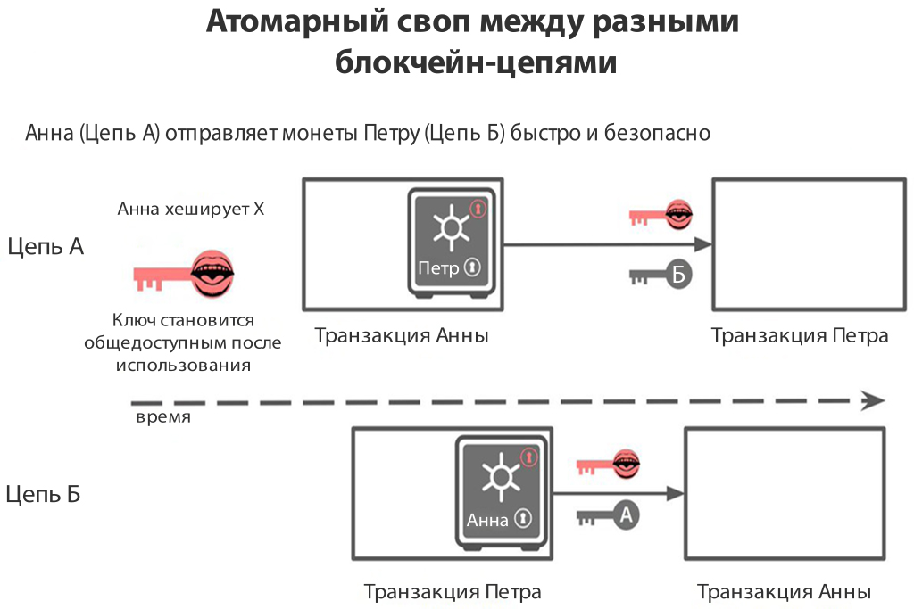

Атомарные свопы
----

### Определение

**Атомарные свопы** - это новая технология для P2P-торговли между различными типами цифровых активов. Ее еще называют трейдингом между блокчейнами. Технология позволяет обменивать цифровые монеты с разных блокчейнов, не пользуясь услугами биржи или иной третьей стороны, выступающей в качестве гаранта выполнения обязательств. 

Впервые [_описанные_](https://bitcointalk.org/index.php?topic=193281.msg2003765#msg2003765) Тиром Ноланом (Tier Nolan) в 2013 году.

Атомарный своп реализуется посредством [hash time-locked contracts](hash-time-locked-contracts.md) (HTLC), или «хэшированные контракты с временной блокировкой». При этом для обеих сторон, участвующих в обмене, полностью исключается риск неисполнения обязательств, обмана и кражи средств. Ни один участник обмена не сможет скрыться с деньгами другой стороны.

### Принцип работы

Рассмотрим механизм обмена криптовалют с помощью атомарного свопа на условном примере. Допустим, у Анны есть биткоины, но ей нужны эфириумы.

Чтобы получить их обычным путем, ей нужно зарегистрироваться на бирже, открыть там счет, создать соответствующий ордер, получить монеты и уплатить при этом комиссию, после чего осуществить вывод средств (опять заплатив комиссию).

Но с атомарными свопами все будет происходить по-другому. Есть Петр, который хочет обменять эфириумы на биткоины. Они с Анной могут провести сделку по обмену.

Для защиты от мошенничества, когда один из участников обмена получил монеты, но еще не отправил свои, в свопах используются хэш-контракты с временной блокировкой ([HTLC](hash-time-locked-contracts.md)). Они гарантируют надежную защиту от недобросовестного поведения сторон обмена.

В этих контрактах используется система транзакций с мультиподписями, в которой оба участника отвечают за успешность свопа.

Чтобы сделать это возможным, hashlock использует криптографический алгоритм, который позволяет пользователям получать доступ к средствам только после того, как обе стороны подписали свои транзакции, а timelock похож на страховой полис, который гарантирует, что оба пользователя получат деньги обратно если сделка не совершится в определенные сроки.

По условиям [HTLC](hash-time-locked-contracts.md) получатель криптовалюты должен одобрить транзакцию до определенного срока, создав для этого криптографическое подтверждение. Если он этого не сделает, то лишается права на получение платежа, и средства возвращаются отправителю.

При этом используется nLockTime — условие транзакции, определяющее минимальное время, до истечения которого транзакция не может быть вписана в блок.

Если транзакции совершаются между различными блокчейнами, то участники обмена сначала должны отправить перевод средств в свой блокчейн. Генерируется секретный код с хэшем, с помощью которого монеты, образно говоря, «выкупаются» с другого блокчейна.

### Алгоритм процедуры обмена

1. Анна, выступающая инициатором обмена, выбирает случайное число X.  
2. Затем Анна создает запись № 1: отправить биткоины на адрес Петра при условии, что ему известен хэш от Х, и сама транзакция подписана Анной и Петром.  
3. После чего Анна создает запись № 2: отправить биткоины на свой адрес (это похоже на то, как если бы их отправили на хранение в сейф до определенного момента) и заблокировать их на определенное время. Данную запись Анна отправляет Петру.  
4. Он подписывает ее и отправляет обратно Анне.  
5. Анна отправляет в сеть первую запись.  
6. Петр создает запись № 3: отправить эфириумы на публичный адрес Анны.  
7. Затем Петр создает запись № 4: отправить эфириумы на свой адрес (на хранение в своеобразный сейф) и заморозить их на определенный срок, с его подписью. Данную запись Петр отправляет Анне.  
8. Она подписывает ее и возвращает Петру.  
9. После этого запись № 3 отправляется в сеть.  
10. Анна получает запись № 3, передавая число Х.  
11. Петр получает запись № 1, используя то же значение Х.

Таким образом реализуется атомарный своп. Но если процесс останавливается, то все отменяется.

### Дополнительные условия

Чтобы криптовалюта смогла участвовать в атомарных транзакциях, она должна соответствовать ряду условий.

Одним из них является внедрение сети Lightning, выполняющей роль связующего звена между различными платежными каналами.

Также для проведения обмена между разными блокчейнами нужно, чтобы обе сети использовали одинаковый алгоритм хэширования. Это обеспечит корректную работу контракта при генерации хэша секретного кода.

Еще одно условие – оба блокчейна должны иметь функцию временной блокировки средств.

### Состояние разработки

Атомарные свопы проводились между монетами:

- Ethereum
- Bitcoin
- Litecoin
- Vertcoin
- Decred
- PaymonCoin

Пока сеть не запущена, для всех этих свопов требуется настроить локальный сервер. Это значит, чтобы обычный пользователь выполнял свопинг между валютами, нужно загрузить полный блокчейн каждой криптовалюты.

Решение — общий сервер для атомарных свопов. Команда Komodo, которая сейчас строит свою  децентрализованную биржу, успешно завершила атомарный своп с использованием сервера Electrum. Это позволяет взаимодействовать, не загружая блокчейн полностью.

Также команда [altcoin.io](https://altcoin.io/) тестирует атомарные свопы ETH/BTC. Сам проект строит  децентрализованную биржу на технологии свопинга.

Насколько каждая криптовалюта близка к поддержке атомарных свопов сайт отслеживает [swapready.​net](https://swapready.net/).

### Применение

Сама технология может вытеснить криптовалютные биржи и обменники, когда они используются именно для получения других монет, а не игры на курсах. Атомарные свопы открывают совершенно новый способ взглянуть на криптографию. Эта технология может использоваться, когда двум сторонам приходится обменивать очень большие или наоборот очень скромные суммы.

Представьте, что вам необходимо обменять 1000 BTC на 50 000 LTC. Использовать биржу, которая теоретически подвержена взлому, безрассудно.

В этом случае, используя технологию атомного свопа, можно напрямую провести крупную сделку. Кроме того, можно быть на 100% уверены, что даже если сделка не состоится, вы не потеряете 1000 BTC.  

### Дополнительные материалы

1. [Decred cross-chain atomic swapping](https://github.com/decred/atomicswap/)
2. [Технический обзор атомарных свопов криптовалюты PaymonCoin](https://crypto.pro/topic/1701/tekhnycheskyi-obzor-atomarnykh-svopov-kryptovaliuty-paymoncoin)
3. [Zcash Bitcoin Cross-Chain Atomic Transactions](https://github.com/zcash-hackworks/zbxcat)
